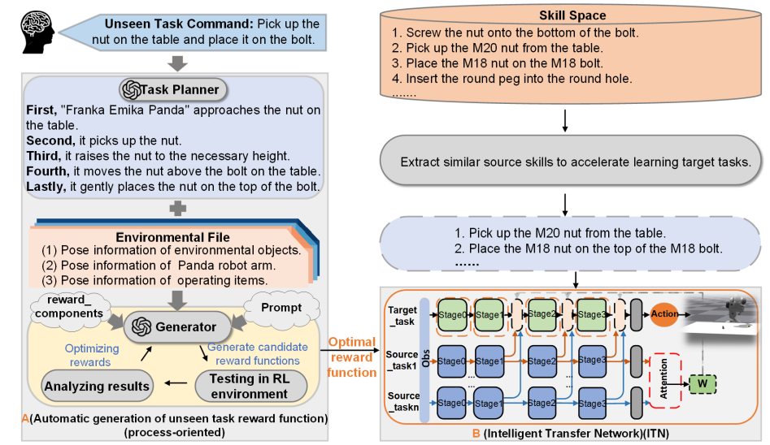

# Task-Oriented Adaptive Learning of Robot Manipulation Skills

<div align="center">

[[Website]](https://jkx-yy.github.io/)
[[PDF] ](https://github.com/JKX-yy/ITN-/blob/master/image/ieeeconf__%E7%AC%AC%E4%BA%94%E7%89%88%E8%8B%B1%E6%96%87___8%E9%A1%B5_.pdf)


[](https://github.com/eureka-research/Eureka)
[](https://pytorch.org/)

______________________________________________________________________

        
</div>
<section class="section">
  <div class="container is-max-desktop">
    <div class="columns is-centered has-text-centered">
      <div class="column is-four-fifths">
        <h2 class="title is-3" align="center"> Abstract </h2>
        <div class="content has-text-justified">
          <p>
            The robot's operating environment and tasks are dynamically changing. Therefore, developing a mechanism that can infer other things from one fact to adapt to various scenarios is crucial for enhancing the robot's adaptive capabilities.  This paper proposes a general Intelligent Transfer System (ITS) to enable rapid skill learning for robots in dynamic tasks.ITS integrate Large Language Models (LLMs) with transfer learning, leveraging LLMs' intelligence and prior skill knowledge to expedite the learning of new skills.  It is capable of comprehending new and previously unseen task conmmands and automatically generating a process-oriented reward function for these task.This approach eliminates the need to design hierarchical sub-processes for  complex tasks. In addition, we designed an intelligent transfer network (ITN) in ITS to extract knowledge of relevant skills for the learning of new ones. This paper's method holds promise for enabling robots to independently solve entirely new operational tasks. We conducted a series of evaluations in a simulation environment, and the experimental results show that our method improves the time efficiency of two major tasks by 72.22\% and 65.17\%, respectively, compared with learning from scratch. Additionally, we compare our method with several outstanding works in the field.  You can get the code with all the experimental videos on our project website：https://jkx-yy.github.io
          </p>
        </div>
      </div>
    </div>
  </div>
</section>


# Installation
Eureka requires Python ≥ 3.8. We have tested on Ubuntu 20.04 and 22.04.

1. Install ITN
```
git clone https://github.com/JKX-yy/ITN-.git
```
We saved our running conda environment in isaacgymenvs/isaacgymenvs/environment.yml, and you only need to do the following steps to create an identical conda environment.You can change the name of your environment in environment.yml.
```
cd isaacgymenvs/isaacgymenvs/
conda env create -f environment.yml
```

2. Install IsaacGym (tested with `Preview Release 4/4`). Follow the [instruction](https://developer.nvidia.com/isaac-gym) to download the package.
```	
tar -xvf IsaacGym_Preview_4_Package.tar.gz
cd isaacgym/python
pip install -e .
(test installation) python examples/joint_monkey.py
```

3. Eureka currently uses OpenAI API for language model queries. You need to have an OpenAI API key to use Eureka [here](https://platform.openai.com/account/api-keys)/. Then, set the environment variable in your terminal
```
export OPENAI_API_KEY= "YOUR_API_KEY"
```

# Getting Started

Navigate to the `eureka` directory and run:
```
python eureka.py env={environment} iteration={num_iterations} sample={num_samples}
```
- `{environment}` is the task to perform. Options are listed in `eureka/cfg/env`.
- `{num_samples}` is the number of reward samples to generate per iteration. Default value is `16`.
- `{num_iterations}` is the number of Eureka iterations to run. Default value is `5`.


Below are some example commands to try out Eureka:
```
python eureka.py env=shadow_hand sample=4 iteration=2 model=gpt-4-0314
```
```
python eureka.py env=humanoid sample=16 iteration=5 model=gpt-3.5-turbo-16k-0613
```
Each run will create a timestamp folder in `eureka/outputs` that saves the Eureka log as well as all intermediate reward functions and associated policies.

Other command line parameters can be found in `eureka/cfg/config.yaml`. The list of supported environments can be found in `eureka/cfg/env`.

# Eureka Pen Spinning Demo
We have released Eureka pen spinning policy in `isaacgymenvs/isaacgymenvs/checkpoints`. Try visualizing it with the following command:
```
cd isaacgymenvs/isaacgymenvs
python train.py test=True headless=False force_render=True task=ShadowHandSpin checkpoint=checkpoints/EurekaPenSpinning.pth
```
Note that this script use the default Isaac Gym renderer and not the Omniverse rendering in the paper videos.

# Running Eureka on a New Environment
1. Create a new IsaacGym environment; instructions can be found in [here](isaacgymenvs/docs/framework.md).
2. Verify that standard RL works for your new environment.
```
cd isaacgymenvs/isaacgymenvs
python train.py task=YOUR_NEW_TASK
```
3. Create a new yaml file `your_new_task.yaml` in `eureka/cfg/env`:
```
env_name: your_new_task
task: YOUR_NEW_TASK 
description: ...
```
4. Construct the raw environment code that will serve as context for Eureka as well as the skeleton environment code on which the Eureka reward will be appended to:
```
cd eureka/utils
python prune_env.py your_new_task
```

5. Try out Eureka!
```
python eureka.py env=your_new_task
```

# Acknowledgement
We thank the following open-sourced projects:
- Our environments are from [IsaacGym](https://github.com/NVIDIA-Omniverse/IsaacGymEnvs) and [DexterousHands](https://github.com/PKU-MARL/DexterousHands/).
- Our RL training code is based on [rl_games](https://github.com/Denys88/rl_games).


# License
This codebase is released under [MIT License](LICENSE).

# Citation
If you find our work useful, please consider citing us!

```bibtex
@article{ma2023eureka,
  title   = {Eureka: Human-Level Reward Design via Coding Large Language Models},
  author  = {Yecheng Jason Ma and William Liang and Guanzhi Wang and De-An Huang and Osbert Bastani and Dinesh Jayaraman and Yuke Zhu and Linxi Fan and Anima Anandkumar},
  year    = {2023},
  journal = {arXiv preprint arXiv: Arxiv-2310.12931}
}
```

Disclaimer: This project is strictly for research purposes, and not an official product from NVIDIA.

